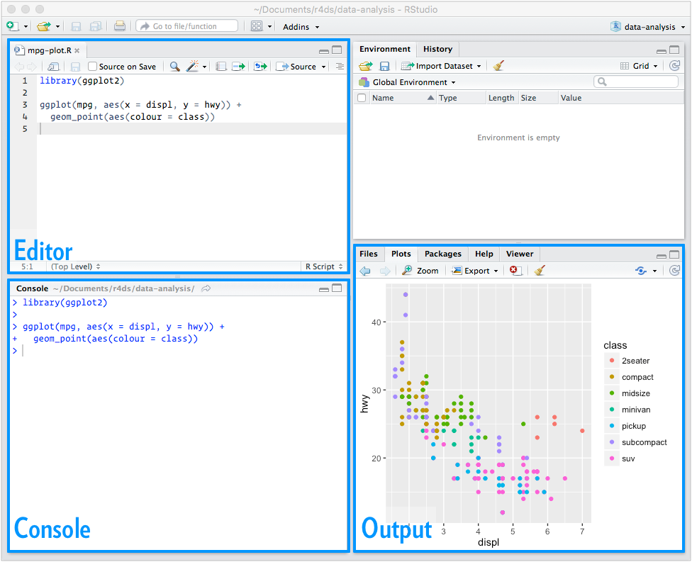

```{r global_options, include=FALSE}
library(dplyr)
library(ggplot2)
library(tufte)
knitr::opts_chunk$set(results = "hide")
knitr::opts_chunk$set(message = FALSE)
knitr::opts_chunk$set(tidy = FALSE)

library(ggplot2)
library(ggrepel)
library(dplyr)
library(readr)
library(MASS)
```

\justify

\newthought{In this course} we will be using the R programming language
in order to do data analysis. This handout shows some of the basic
commands that we will be using in the course. Other handouts will
introduce specific concepts such as graphics, data manipulation, and
regression analyses.

# Set up

## Obtaining R and RStudio

To run the code in this and future labs, you will need to install both
R and the RStudio IDE. Both are open source, free, and easy to install.
They are already available on our lab computers, but you can install
manually on your own machine from the following sources:

- Download and install R, <https://www.r-project.org/>.
- Download and install RStudio, <http://www.rstudio.com/download>.

Go ahead and launch RStudio. You should see a window that looks like
the image in the margin.

```{r, results = "asis", echo = FALSE, out.width = "100%", fig.fullwidth = TRUE, eval = TRUE, fig.cap = "The default RStudio prompt when first logging in.", fig.margin = TRUE}
knitr::include_graphics("img/r-interface-2016.png")
```

The panel on the left is where the action happens. It's called the *console*.
Every time you launch RStudio, it will have the same text at the top of the
console telling you the version of R that you're running. Below that information
is the *prompt*. As its name suggests, this prompt is really a request, a
request for a command. Initially, interacting with R is all about typing commands
and interpreting the output. These commands and their syntax have evolved over
decades (literally) and now provide what many users feel is a fairly natural way
to access data and organize, describe, and invoke statistical
computations.^[As a simple example, try to use R as a fancy calculator. Type
something like `1 + 1` or `1 + pi` and hit enter.]

The panel in the upper right contains your *workspace* as well as a history of
the commands that you've previously entered.
Any plots that you generate will show up in the panel in the lower right corner.
This is also where you can browse your files, access help, manage packages, etc.

## Installing packages

There are many user-created scripts that are wrapped up in objects called
**packages**. These will be very useful in being productive with R. To
download the packages we need today, run the following line of code in
R:
```{r, eval = FALSE}
install.packages("tidyverse")
```
It may take a few minutes to finish downloading the data.

## The tidyverse

The majority of the packages that we will be using are part of the
so-called tidyverse. All packages in the tidyverse share a common philosophy
of data and R programming, which makes them fit together naturally. Because
they are designed with a unifying vision you should experience fewer problems
when you combine multiple packages to solve real problems. The packages in
the tidyverse are not perfect, but they fit together well, and over time that
fit will continue to improve.

There are many other excellent packages that are not part of the tidyverse,
because they are designed with a different set of underlying principles.
This doesn't make them better or worse, just different. In other words,
the complement to the tidyverse is not the messyverse, but many other
universes of interrelated packages.

## Resources for learning R and working in RStudio

We will provide you with more functions and a more complete sense of the
language as the course progresses. In addition to asking in class, consulting
your lab notes and attending office hours, there are many resources for
learning how to work with R. In particular these cheatsheets may come in
handy (click on them for the links):

- [Data visualization cheatsheet](http://www.rstudio.com/wp-content/uploads/2015/12/ggplot2-cheatsheet-2.0.pdf)
- [Data wrangling cheatsheet](http://www.rstudio.com/wp-content/uploads/2015/02/data-wrangling-cheatsheet.pdf)

Also, if you are googling for R code, you may need to include the package names
ggplot2 (for graphics) or dplyr (for data manipulation). For example, instead of
googling "scatterplot in R", google "scatterplot in R with ggplot2".

# R Workflow

So far you've been using the console to run code. That's a great place to start,
but you'll find it starts to get cramped pretty quickly as you create more complex
ggplot2 graphics. To give yourself more room to work, it's essential to use the
script editor. Open it up either clicking the File menu, and selecting New File,
then R script, or using the keyboard shortcut Cmd/Ctrl + Shift + N. Now you'll
see four panes.

```{r, results = "asis", echo = FALSE, out.width = "100%", fig.fullwidth = TRUE, eval = TRUE, fig.cap = "RStudio with the script editor shown.", fig.margin = TRUE}

```

The script editor is a great place to put code you care about. Keep experimenting
in the console, but once you get some code that does what you want, put it in the
script editor.

The key to using the script editor effective is to memorize one of the most
important keyboard shortcuts: Cmd/Ctrl + Enter. This executes the current
R expression in the console. You can run the complete script with one press:
Cmd/Ctrl + Shift + S. Doing this regularly is a great way to check that you've
captured all the important parts of your code in the script. We recommend that
you always start your script with the packages that you need. That way, if
you share you code with others, they can easily see what packages they need
to install.^[You
may be tempted to save you code in a word processing program such as MS Word. This is
not advised as these programs modify what you type in ways that will not work when you
copy them back into R. For example, quotation marks will get converted to fancy quotation
marks.]

The script editor will also highlight syntax errors with a red squiggly line
and a cross in the sidebar. When working through future chapters, I highly recommend
starting in the editor and practicing your the keyboard shortcuts.
Over time, sending code to the console in this way will become so natural that you
won't even think about it.

At the end of our labs, or when working on data analyses, you will likely want to
save the code from your script editor somewhere. You can do this by clicking on the
disk button, or typing Cmd/Ctrl + S. The file will get saved with a .R extension.
You can open this back up in RStudio by going to the File menu and selecting open.

# Common problems

As you start to run R code, you're likely to run into problems. Don't worry --- it
happens to everyone. I have been writing R code for years, and every day I still
write code that doesn't work!^[This was originally a line in Hadley Wickham's notes,
but I've kept it because it is 100% true for me as well!]

Start by carefully comparing the code that you're running to the code in the book.
R is extremely picky, and a misplaced character can make all the difference. Make
sure that every `(` is matched with a `)` and every `"` is paired with another `"`.
Sometimes you'll run the code and nothing happens. Check the left-hand of your
console: if it's a `+`, it means that R doesn't think you've typed a complete
expression and it's waiting for you to finish it. In this case, it's usually
easy to start from scratch again by pressing `Escape` to abort processing the
current command.

# Basic coding guidelines

Some futher suggestions that should keep your code easy to work with
and relatively bug-free (note that some of these will only make sense
later on):

  - write all of your code in the script editor
  - save your code (frequently) as a .R file
  - run lines of code using the **Run** command in the script editor
  - if you have a problem, work your way through the script to find
    the first line where there is an error (not a warning)
  - make sure that the console starts with the `>` sign and not
    the `+` sign when running your code
  - never write code into the right margin; always wrap it so you
    can see everything
  - group code statements together (i.e., library statements, reading
    in data, building a plot, cleaning the data, fitting a model) and
    put a space between blocks of code
  - place comments, using the `#` symbol at the start of a line, before
    blocks of code to describe what they are trying to accomplish

I will expect to be able to run your submitted code without any modification,
so all text answers should be commented out with the `#` sign.


